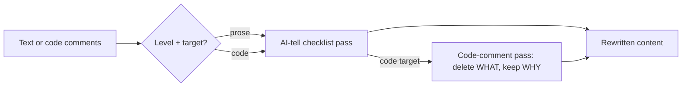

[](https://agentskills.io)

> Strip the AI accent from text and code — same facts, human rhythm.

---

## About

humanize takes already-correct content and removes the surface patterns that read as machine-generated: throat-clearing openers, rule-of-three lists, hollow intensifiers, em-dash overuse, uniform sentence rhythm, closing summaries nobody asked for. Every fact, code block, and technical detail stays exactly as-is.

Two targets:

- **Prose** — chat replies, docs, PR descriptions, commit bodies, ticket comments.
- **Code comments** — same prose pass, plus a second pass: delete comments that restate what the code already says, keep only non-obvious WHY comments.

Three levels: `light` (strip the loudest tells only), `full` (default, full rewrite), `aggressive` (full + restructure over-listed answers back to prose).

Fires on natural-language requests in any [agentskills.io](https://agentskills.io)-compatible agent. Also ships a `/humanize` slash command for Claude Code.

---

## Technologies

- **[agentskills.io](https://agentskills.io) SKILL.md format** — agent-agnostic skill spec; works in Claude Code, OpenCode, or any agent that supports the format.

---

## Prerequisites

- Any [agentskills.io](https://agentskills.io)-compatible AI coding agent (Claude Code, OpenCode, or equivalent).
- No other dependencies — the skill is pure SKILL.md instructions, no scripts.

---

## Installation

### Clone the repository

```bash
git clone https://github.com/wagner-sousa/humanize.git
cd humanize
```

### Copy the skill into your project

Paths below use Claude Code's layout — swap `.claude/` for your agent's skills directory if it differs.

```bash
cp -r skills/humanize <your-project>/.claude/skills/
```

To also get the `/humanize` slash command (Claude Code only):

```bash
cp commands/humanize.md <your-project>/.claude/commands/
```

No hooks needed — the skill is triggered by natural language or the slash command directly.

---

## Configuration

The skill has no `config.json`. Behavior is driven by the level and target you pass at call time:

| Option | Values | Default |
|---|---|---|
| level | `light` / `full` / `aggressive` | `full` |
| target | `prose` / `code` | `prose` |

---

## Project Structure

```
humanize/
├── skills/
│   └── humanize/
│       └── SKILL.md               # skill definition: rules, levels, code-comment pass
├── commands/
│   └── humanize.md                # /humanize slash command (Claude Code)
├── LICENSE
└── README.md
```

---

## Usage

### Natural language (any agent)

Ask in plain language: "make this sound more human", "clean up these comments", "remove the AI tics from my PR description". The skill fires on the description keywords.

### Slash command (Claude Code)

```bash
/humanize                           # full level, prose target
/humanize light
/humanize aggressive
/humanize code                      # code-comment target, full level
/humanize aggressive code
```

---

## Architecture



---

## License

This project is licensed under the MIT License. See the [LICENSE](LICENSE) file for details.

---

## Contact

**Wagner Sousa**

[](https://github.com/wagner-sousa)
