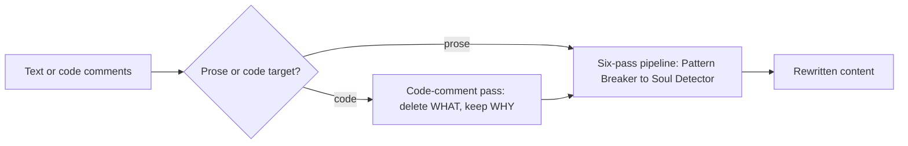

[](https://agentskills.io)

> Strip the AI accent from text and code — same facts, human rhythm.

---

## About

humanize takes already-correct content and removes the surface patterns that read as machine-generated: throat-clearing openers, rule-of-three lists, hollow intensifiers, em-dash overuse, uniform sentence rhythm, closing summaries nobody asked for. Every fact, code block, and technical detail stays exactly as-is.

Two targets:

- **Prose** — chat replies, docs, PR descriptions, commit bodies, ticket comments.
- **Code comments** — same six-pass pipeline, plus a step before it: delete comments that restate what the code already says, keep only non-obvious WHY comments.

Runs a sequential six-pass editing pipeline — Pattern Breaker, Credibility Test, Voice Modeler, Imperfection Injector, Audio Test, Soul Detector — each pass building on the previous one's output, not the original text.

Fires on natural-language requests in any [agentskills.io](https://agentskills.io)-compatible agent — no command syntax required.

---

## Technologies

- **[agentskills.io](https://agentskills.io) SKILL.md format** — agent-agnostic skill spec; works in Claude Code, O‍penCode, or any agent that supports the format.

---

## Prerequisites

- Any [agentskills.io](https://agentskills.io)-compatible AI coding agent (Claude Code, O‍penCode, or equivalent).
- No other dependencies — the skill is pure SKILL.md instructions, no scripts.

---

## Installation

### Clone the repository

```bash
git clone https://github.com/wagner-sousa/humanize.git
cd humanize
```

### Copy the skill into your project

Paths below use Claude Code's layout — swap `.claude/` for your agent's skills directory if it differs.

```bash
cp -r skills/humanize <your-project>/.claude/skills/
```

No hooks or commands needed — the skill is triggered by natural language directly.

---

## Configuration

The skill has no `config.json`. The only thing you pass at call time is the target:

| Option | Values | Default |
|---|---|---|
| target | `prose` / `code` | `prose` |

---

## Project Structure

```
humanize/
├── skills/
│   └── humanize/
│       └── SKILL.md               # skill definition: six-pass pipeline, code-comment pass
├── LICENSE
└── README.md
```

---

## Usage

Ask in plain language: "make this sound more human", "clean up these comments", "remove the AI tics from my PR description", "this reads like ChatGPT wrote it". The skill fires on the description keywords — no command syntax needed. Say which target (prose or code comments) if it isn't obvious from what you're pointing at.

---

## Architecture



---

## License

This project is licensed under the MIT License. See the [LICENSE](LICENSE) file for details.

---

## Contact

**Wagner Sousa**

[](https://github.com/wagner-sousa)
